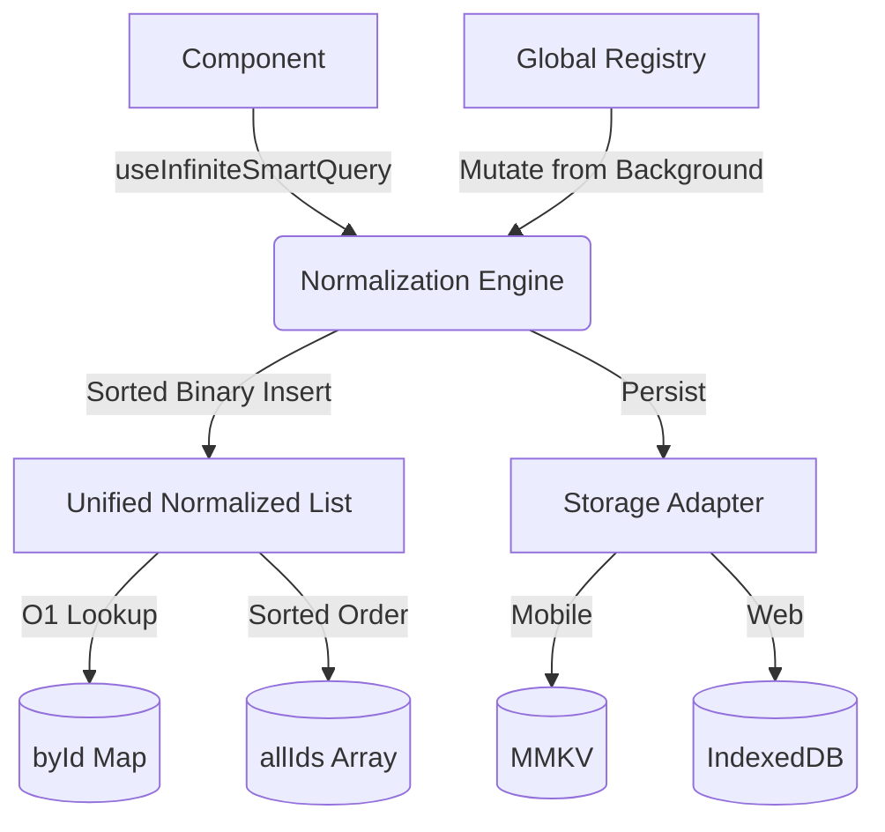

# 🧠 React Smart Query

**Production-grade, offline-first, normalized data orchestration for React Native and Web.**

React Smart Query is more than just a cache; it's a high-performance normalization engine designed to handle complex, paginated lists with predictable, O(log n) mutations — even when offline.

[](https://www.npmjs.com/package/react-smart-query)
[](https://opensource.org/licenses/MIT)

---

## 🚀 Why React Smart Query?

Handling mutations in paginated lists (Infinite Scroll) is notoriously difficult in modern UI frameworks. Standard tooling often results in:
1. **Data Duplication:** The same resource existing in multiple pages of a query response cache, leading to out-of-sync UI components.
2. **Inconsistent Ordering:** Newly added optimistic items appearing at the top/bottom rather than their correct sorted semantic position, causing visual "jumps" on next load.
3. **Complex Manual Cache Logic:** Forcing developers to write intricate, error-prone traversal logic just to update a single nested item deep inside a page array.

**React Smart Query solves this by adopting a Unified Normalized Storage model.**

Instead of storing data exactly as the API returns it (as a paginated chunk of arrays), React Smart Query intercepts the data, extracts individual entities (using your provided `getItemId`), and stores them in a single, perfectly sorted, globally accessible dictionary (`byId`) and array (`allIds`).

- **O(log n) Sorted Mutations**: Items are inserted into the single, global sorted list using binary search. Adding a new item guarantees it instantly lands in the mathematically correct position according to your `sortComparator`.
- **Automatic Deduplication**: Because items are normalized by ID, an item fetched in Page 1 and (erroneously) returned again in Page 3 only ever exists once in the engine.
- **Offline-First & Auto-Sync**: A built-in mutation queue automatically captures changes made while offline, persists them to local storage (MMKV/IndexedDB), and plays them back to your server seamlessly when the connection returns.
- **Derived Pagination**: Pagination is treated strictly as a "slice" view over your normalized data, not how the data is stored. Your UI always receives perfectly contiguous, sorted data.
- **Memory Protected**: Automatic "soft trimming" algorithm monitors list sizes and safely drops least-recently-seen items to prevent infinite scroll memory bloat on low-end devices.

### How it compares to TanStack Query

React Smart Query is **built on top of** TanStack Query. It uses TanStack Query for the networking, background refetching, and general request lifecycle, but completely replaces how the returned data is cached and mutated.

| Feature | TanStack Query | React Smart Query |
| :--- | :--- | :--- |
| **Primary Focus** | Server State Synchronization | Normalized Data Orchestration & Mutability |
| **Data Storage** | Raw API Responses (Arrays/Objects) | Unified Normalized Dictionary (`byId` & `allIds`) |
| **Infinite List Mutations** | Manual Cache Traversal (`setQueryData`) | `O(log n)` Binary Search Auto-Insertions |
| **Deduplication** | Across identical URL endpoints | Across entire application by Item ID |
| **Offline Mutations** | Difficult (Requires manual hydration/plugins) | Built-in Persistent Queue & Auto-Sync |
| **Memory Management** | Time-based garbage collection | Time-based + Soft trimming of large lists |

---

## 📦 Installation

```bash
npm install react-smart-query @tanstack/react-query react-native-mmkv
```

---

## 🛠️ Quick Start

### 1. Basic Query

```tsx
import { useSmartQuery } from 'react-smart-query';

const { data, isLoading } = useSmartQuery({
  queryKey: ['profile'],
  queryFn: () => api.get('/me'),
  select: (res) => res.user,
});
```

### 2. Infinite Scroll (The Real Magic)

```tsx
const { data, addItem, fetchNextPage } = useInfiniteSmartQuery({
  queryKey: ['expenses'],
  queryFn: ({ pageParam }) => api.get('/expenses', { cursor: pageParam }),
  getNextCursor: (res) => res.nextCursor,
  select: (res) => res.items,
  getItemId: (item) => item.id,
  sortComparator: (a, b) => b.createdAt - a.createdAt, // Perfect sort across all pages
});

// Adding an item "just works" and inserts into the correct sorted position
const onAdd = () => addItem({ id: '123', description: 'Coffee', createdAt: Date.now() });
```

---

## 🏗️ Architecture



---

## 🔥 Professional Features

- **Mutation Conflict Guards**: Prevents stale background updates from overwriting fresher local data.
- **Batch Updates**: Group multiple mutations into a single storage write and render.
- **Smart Diffing**: 5-tier hybrid comparison ensures components only re-render when data actually changes.
- **DevTools**: Inspect internal normalized state, cache hits/misses, and in-flight requests in development.

---

## 💡 When to use?

✅ **Use if**:
- You have high-frequency updates in paginated lists (e.g., Chat, Feeds, Transactions).
- You need robust offline support with optimistic UI.
- You want to eliminate "flicker" when items change positions.

❌ **Avoid if**:
- Your data is small and non-relational.
- You don't need offline persistence or sorted lists.

## 📚 Full Documentation

For advanced usages, hooks APIs, and architectural guidelines, please see the full documentation:
- [API Reference](./docs/API_REFERENCE.md)
- [Guidelines & Best Practices](./docs/GUIDELINES.md)
- [Testing & Debugging](./docs/TESTING.md)

---

## 📄 License
MIT © 2024 React Smart Query Team
