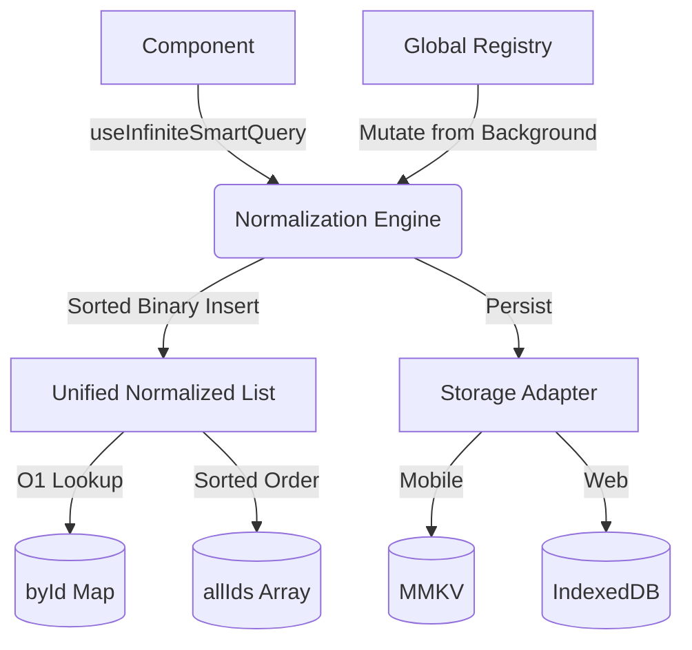

# 🧠 Smart Query

**Production-grade, offline-first, normalized data orchestration for React Native and Web.**

Smart Query is more than just a cache; it's a high-performance normalization engine designed to handle complex, paginated lists with predictable, O(log n) mutations — even when offline.

[](https://www.npmjs.com/package/smart-query)
[](https://opensource.org/licenses/MIT)

---

## 🚀 Why Smart Query?

Handling mutations in paginated lists (Infinite Scroll) is notoriously difficult. Standard tools often lead to data duplication, inconsistent sort orders, or complex "manual cache manipulation" logic.

**Smart Query solves this by using a Unified Normalized Storage model.**

- **O(log n) Sorted Mutations**: Items are inserted into a single, global sorted list using binary search.
- **Automatic Deduplication**: Never worry about the same item appearing twice across pages.
- **Offline-First**: Built-in mutation queue with persistence (MMKV/IndexedDB) and auto-sync.
- **Derived Pagination**: Pagination is a "view" over your data, not how it's stored.
- **Memory Protected**: Automatic "soft trimming" of large lists to prevent memory bloat.

---

## 📦 Installation

```bash
npm install smart-query @tanstack/react-query react-native-mmkv
```

---

## 🛠️ Quick Start

### 1. Basic Query

```tsx
import { useSmartQuery } from 'smart-query';

const { data, isLoading } = useSmartQuery({
  queryKey: ['profile'],
  queryFn: () => api.get('/me'),
  select: (res) => res.user,
});
```

### 2. Infinite Scroll (The Real Magic)

```tsx
const { data, addItem, fetchNextPage } = useInfiniteSmartQuery({
  queryKey: ['expenses'],
  queryFn: ({ pageParam }) => api.get('/expenses', { cursor: pageParam }),
  getNextCursor: (res) => res.nextCursor,
  select: (res) => res.items,
  getItemId: (item) => item.id,
  sortComparator: (a, b) => b.createdAt - a.createdAt, // Perfect sort across all pages
});

// Adding an item "just works" and inserts into the correct sorted position
const onAdd = () => addItem({ id: '123', description: 'Coffee', createdAt: Date.now() });
```

---

## 🏗️ Architecture



---

## 🔥 Professional Features

- **Mutation Conflict Guards**: Prevents stale background updates from overwriting fresher local data.
- **Batch Updates**: Group multiple mutations into a single storage write and render.
- **Smart Diffing**: 5-tier hybrid comparison ensures components only re-render when data actually changes.
- **DevTools**: Inspect internal normalized state, cache hits/misses, and in-flight requests in development.

---

## 💡 When to use?

✅ **Use if**:
- You have high-frequency updates in paginated lists (e.g., Chat, Feeds, Transactions).
- You need robust offline support with optimistic UI.
- You want to eliminate "flicker" when items change positions.

❌ **Avoid if**:
- Your data is small and non-relational.
- You don't need offline persistence or sorted lists.

---

## 📄 License
MIT © 2024 Smart Query Team
